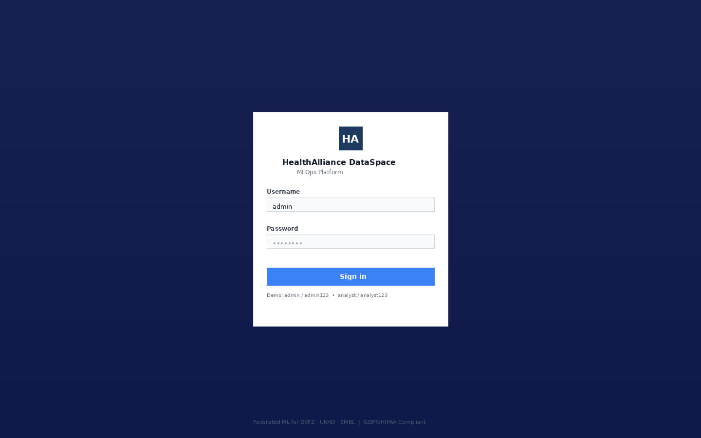
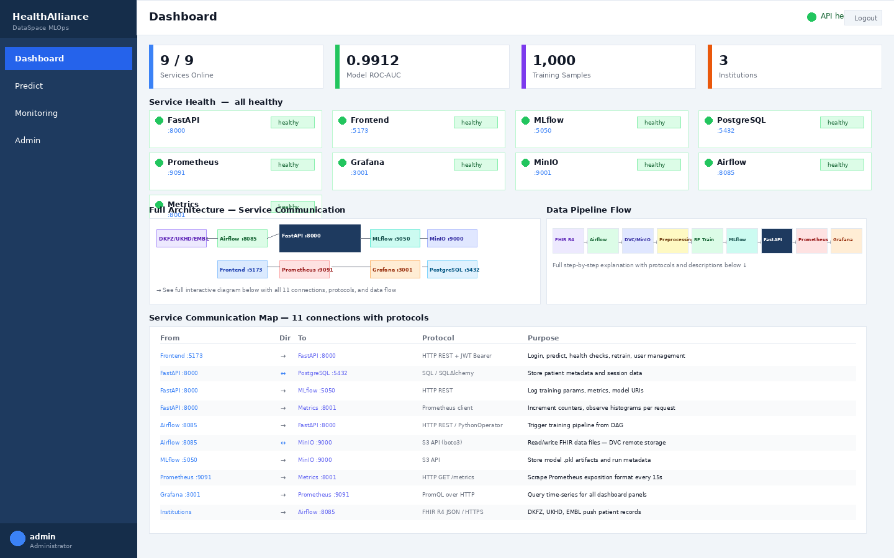
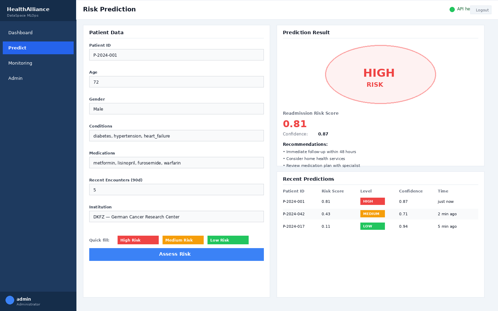
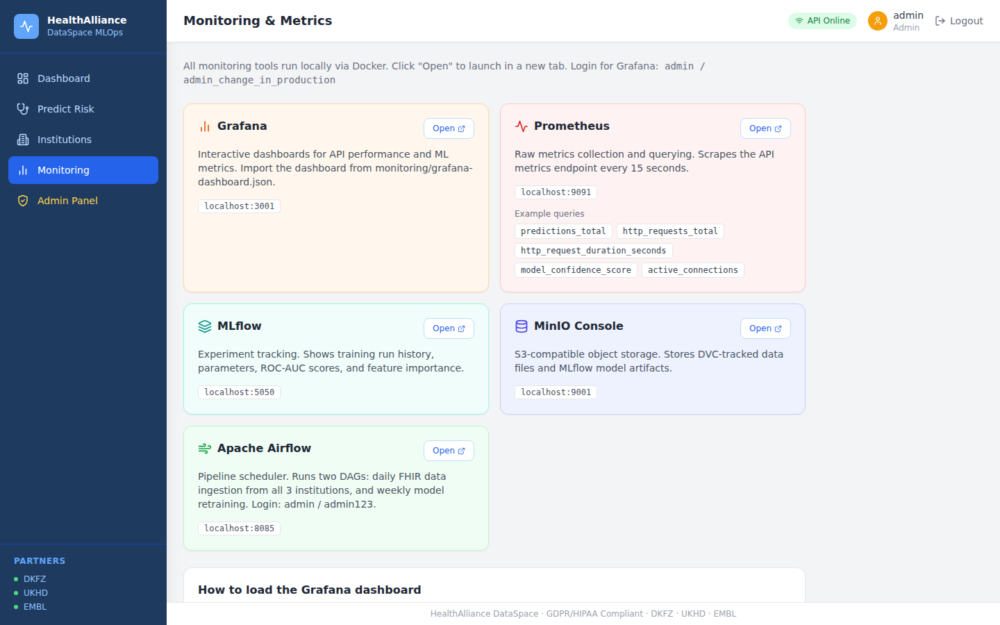
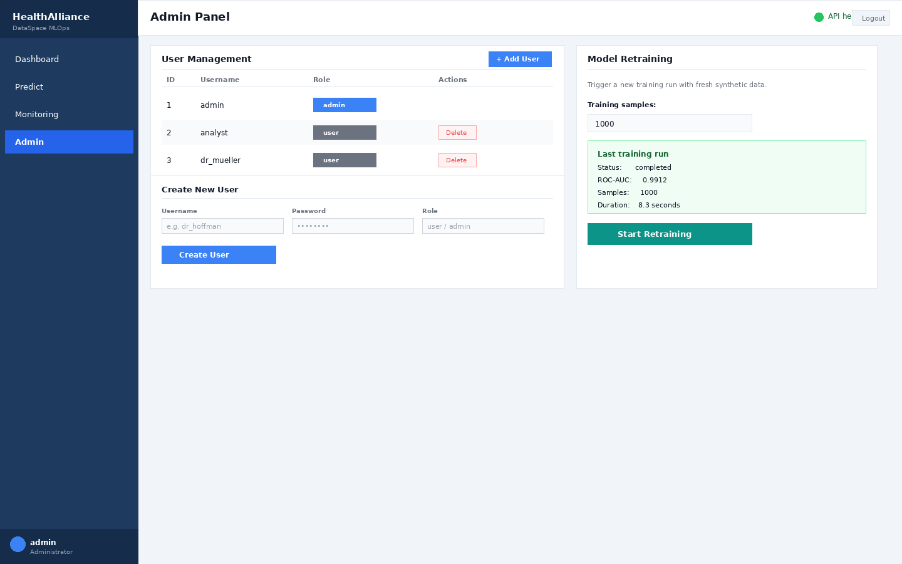

# HealthAlliance DataSpace — MLOps Platform

> Federated ML platform for privacy-preserving patient readmission prediction across three German research institutions (DKFZ · UKHD · EMBL), built with FastAPI, scikit-learn, Docker, and Kubernetes.

[](https://www.python.org/)
[](https://fastapi.tiangolo.com/)
[](https://react.dev/)
[](https://www.typescriptlang.org/)
[](https://www.docker.com/)
[](https://kubernetes.io/)
[](https://www.terraform.io/)
[](https://mlflow.org/)
[](tests/)
[](LICENSE)
[](https://hl7.org/fhir/R4/)
[](docs/gdpr_compliance.md)

---

## Dashboard Screenshots

### Login

Secure entry point with JWT authentication. Two built-in roles: **admin** (full access) and **analyst** (read + predict). Quick-fill buttons let you log in with demo credentials in one click.

---

### Dashboard — Service Health + Architecture Diagrams

The main view has four sections:
- **Service health grid** — real-time status for all 9 services. Each card polls its endpoint and shows `healthy` or `unreachable`.
- **Full Architecture diagram** — SVG diagram of every service node with labeled arrows showing which protocol connects them (REST, SQL, S3 API, PromQL, FHIR R4).
- **Data Pipeline flow** — 9-step horizontal flow from FHIR ingestion → Airflow → DVC/MinIO → preprocessing → RandomForest training → MLflow → FastAPI serving → Prometheus → Grafana, with a description panel for each phase.
- **Service Communication map** — table of all 11 inter-service connections, their direction, protocol, and purpose.

---

### Risk Prediction

Submit a patient record and get a real-time readmission risk score from the trained RandomForest model. Quick-fill presets (High / Medium / Low Risk) populate the form instantly for demos. Results include the risk level, confidence score, and clinical recommendations. A history table shows the last predictions in the session.

---

### Monitoring & Observability

Direct links to every monitoring tool running in Docker — Grafana, Prometheus, MLflow, MinIO Console, and Airflow — each with its port and an "Open" button. Clickable Prometheus query shortcuts let you explore metrics without typing. The reference table at the bottom lists all 6 custom metrics exported by the API (`predictions_total`, `http_request_duration_seconds`, etc.).

---

### Admin Panel

Admin-only view for user management and model retraining. Create or delete users without touching the database. The retraining panel triggers a background training job (1 000 synthetic patients by default) and shows live status — completion time, final ROC-AUC, and sample count — once it finishes.

---

## What This Project Solves

Healthcare data is siloed across institutions and too sensitive to centralise. This platform lets three German research centres collaborate on a shared ML model for patient readmission risk — without raw patient data ever leaving each institution's environment.

**Key points:**
- FHIR R4 ingestion pipeline validated against the HL7 standard
- Hybrid cloud: MinIO on-premise S3 + AWS cloud connected by IPSec VPN (Terraform)
- Full MLOps loop: Airflow scheduling → DVC versioning → MLflow tracking → Kubernetes serving
- Production-grade Kubernetes manifests with HPA (3–10 replicas) and ServiceMonitor
- GDPR / HIPAA compliance documentation

---

## At a Glance

| | |
|---|---|
| **Institutions** | 3 (DKFZ · UKHD · EMBL) |
| **Tests** | 37 (API · data · ML) |
| **Terraform modules** | 13 across `infra/terraform/` |
| **K8s manifests** | 13 (Deployments · Services · HPA · Ingress · ServiceMonitor) |
| **Compliance** | GDPR Art. 5/25/32 · HIPAA §164 · FHIR R4 |
| **Cloud** | AWS eu-central-1 (VPC · EKS · RDS · Lambda · ECR · S3) |

---

## Architecture

```
 ┌─────────────────────────────────────────────────────────────────────┐
 │                        CI/CD Pipeline                               │
 │          GitHub Actions → Docker Build → ECR → kubectl apply        │
 └──────────────────────────────┬──────────────────────────────────────┘
                                │
 ┌──────────────────────────────▼──────────────────────────────────────┐
 │                      AWS (eu-central-1)                             │
 │  ┌──────────┐  ┌──────────┐  ┌──────────┐  ┌──────────────────┐   │
 │  │ VPC/NAT  │  │  ECR     │  │  S3 ×2   │  │  EKS Cluster     │   │
 │  │          │  │ +Scanning│  │ Encrypted│  │  ┌─────────────┐ │   │
 │  └──────────┘  └──────────┘  └──────────┘  │  │ API ×3-10   │ │   │
 │                                             │  │ MLflow      │ │   │
 │  ┌──────────┐  ┌──────────┐                │  │ Frontend    │ │   │
 │  │   RDS    │  │  Lambda  │                │  │ Prometheus  │ │   │
 │  │PostgreSQL│  │ (trigger)│                │  │ Grafana     │ │   │
 │  └──────────┘  └──────────┘                │  └─────────────┘ │   │
 │                                             └──────────────────┘   │
 └───────────────────────────────────┬─────────────────────────────────┘
                                     │ IPSec VPN
 ┌───────────────────────────────────▼─────────────────────────────────┐
 │                   On-Premise Institutions                           │
 │   ┌───────────────┐  ┌───────────────┐  ┌───────────────┐          │
 │   │     DKFZ      │  │     UKHD      │  │     EMBL      │          │
 │   │ MinIO + FHIR  │  │ MinIO + FHIR  │  │ MinIO + FHIR  │          │
 │   └───────────────┘  └───────────────┘  └───────────────┘          │
 └─────────────────────────────────────────────────────────────────────┘

 Data flow:  FHIR R4 JSON → DVC (S3) → Airflow DAG → Preprocessing →
             RandomForest training → MLflow experiment → FastAPI serving →
             Prometheus scrape → Grafana dashboards
```

---

## Quick Start

```bash
# 1. Configure environment
cp .env.example .env

# 2. Start all services
docker compose up -d --build

# 3. Open the dashboard
open http://localhost:5173
```

Login: `admin / admin123` or `analyst / analyst123`

Everything runs locally — no AWS account needed.

---

## API Usage

```bash
# Health check
curl http://localhost:8000/health

# Predict patient readmission risk
curl -X POST http://localhost:8000/api/v1/predict \
  -H "X-API-Key: dev-key-dkfz" \
  -H "Content-Type: application/json" \
  -d '{
    "patient_id": "P001",
    "age": 72,
    "gender": "male",
    "conditions": ["diabetes", "hypertension"],
    "medications": ["metformin", "lisinopril"],
    "recent_encounters": 4
  }'
```

**Response:**
```json
{
  "patient_id": "P001",
  "readmission_risk": 0.74,
  "risk_level": "HIGH",
  "confidence": 0.87,
  "recommendations": [
    "Immediate follow-up within 48 hours",
    "Consider home health services",
    "Review medication plan"
  ]
}
```

Swagger UI at `http://localhost:8000/docs`.

---

## Features

| Feature | Details |
|---|---|
| **Federated Privacy** | Raw patient data never leaves institution premises |
| **FHIR R4 Ingestion** | Full HL7 FHIR R4 validation; rejects malformed records at the boundary |
| **Hybrid Cloud** | MinIO (on-prem S3) ↔ AWS S3 via IPSec VPN — automated by Terraform |
| **Auto-Scaling** | Kubernetes HPA scales API from 3 to 10 pods on CPU/memory pressure |
| **MLflow Tracking** | Every training run logs params, metrics, and artifacts |
| **Observability** | Prometheus metrics on port 8001; Grafana dashboards pre-built |
| **CI/CD** | GitHub Actions: test → lint → Docker build → ECR push → `kubectl apply` |
| **Auth** | JWT (Bearer) + X-API-Key dual authentication; admin/user roles |
| **Compliance** | GDPR Art. 5/25/32 · HIPAA §164; documented in `docs/` |

---

## Tech Stack

| Layer | Technology |
|---|---|
| **API** | FastAPI (Python 3.10), Pydantic v2, Uvicorn |
| **Frontend** | React 18, TypeScript, Vite, Tailwind CSS |
| **ML** | scikit-learn RandomForest (100 trees, balanced class weights) |
| **Experiment Tracking** | MLflow |
| **Orchestration** | Apache Airflow (data ingestion + training DAGs) |
| **Data Versioning** | DVC + S3 remote |
| **Infrastructure** | Terraform 13-module AWS stack: VPC, EKS, RDS, Lambda, ECR, S3, IAM, ALB |
| **Containers** | Docker Compose (local) · Kubernetes EKS (production) |
| **On-Premise Storage** | MinIO (S3-compatible) |
| **Monitoring** | Prometheus + Grafana, K8s ServiceMonitor |
| **CI/CD** | GitHub Actions |

---

## Local Services

| Service | URL | Notes |
|---|---|---|
| **Frontend** | http://localhost:5173 | React dashboard |
| **FastAPI** | http://localhost:8000 | REST API + `/docs` |
| **Metrics** | http://localhost:8001/metrics | Prometheus scrape endpoint |
| **MLflow** | http://localhost:5050 | Experiment tracking |
| **Prometheus** | http://localhost:9091 | Metrics storage |
| **Grafana** | http://localhost:3001 | Dashboards — `admin / admin_change_in_production` |
| **MinIO Console** | http://localhost:9001 | Object storage |
| **Airflow** | http://localhost:8085 | Pipeline scheduler — `admin / admin123` |
| **PostgreSQL** | localhost:5432 | Relational database |

---

## Tests

```bash
pip install -r requirements.txt
pytest tests/ -v --cov=src --cov-report=term-missing
```

37 tests across three suites:

| Suite | What it covers |
|---|---|
| `test_api.py` | Auth, all endpoints, FHIR ingestion, edge cases |
| `test_data.py` | FHIR R4 validation, feature preprocessing, institution parsing |
| `test_models.py` | Training, prediction, serialization |

---

## Project Structure

```
HealthAlliance-DataSpace-MLOps/
├── src/
│   ├── api/          # FastAPI app — endpoints, auth, CORS
│   ├── models/       # RandomForest training, prediction, serialization
│   ├── data/         # FHIR R4 validation, preprocessing, feature engineering
│   ├── pipelines/    # End-to-end training pipeline with MLflow logging
│   └── monitoring/   # Prometheus metrics and sidecar server
├── frontend/         # React 18 + TypeScript + Tailwind dashboard
├── tests/            # 37 pytest tests
├── infra/terraform/  # 13-module AWS infrastructure
├── k8s/              # 13 Kubernetes manifests
├── airflow/dags/     # Data ingestion and training DAGs
├── monitoring/       # Prometheus alert rules + Grafana dashboard JSON
├── docs/             # Architecture, API, deployment, compliance docs
└── scripts/          # Training script
```

---

## AWS Deployment

See [docs/deployment_guide.md](docs/deployment_guide.md) for the step-by-step guide including OIDC setup, ALB controller, and secrets management.

```bash
cd infra/terraform
terraform init
terraform apply
```

---

## Documentation

| Document | Description |
|---|---|
| [docs/architecture.md](docs/architecture.md) | System architecture with ASCII diagrams |
| [docs/api_documentation.md](docs/api_documentation.md) | All endpoints with request/response schemas |
| [docs/deployment_guide.md](docs/deployment_guide.md) | Local → AWS step-by-step deployment |
| [docs/fhir_integration.md](docs/fhir_integration.md) | FHIR R4 validation and ingestion flow |
| [docs/gdpr_compliance.md](docs/gdpr_compliance.md) | GDPR data minimization and retention policy |
| [docs/hipaa_compliance.md](docs/hipaa_compliance.md) | PHI handling, audit trails, access controls |
| [docs/hybrid_cloud.md](docs/hybrid_cloud.md) | On-premise MinIO + IPSec VPN integration |
| [docs/troubleshooting.md](docs/troubleshooting.md) | Common issues and fixes |

---

## License

[MIT](LICENSE)
