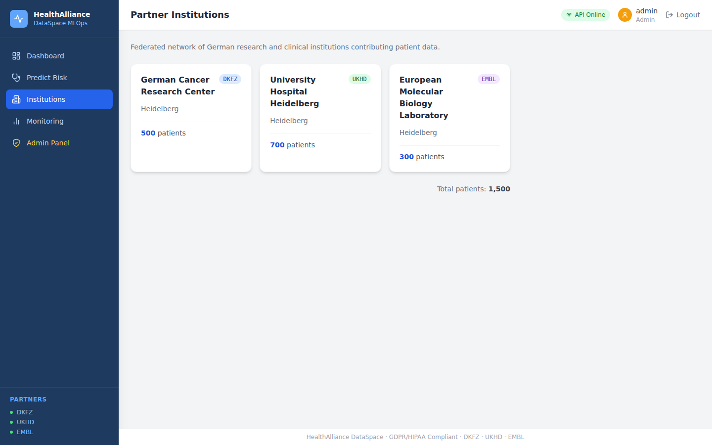
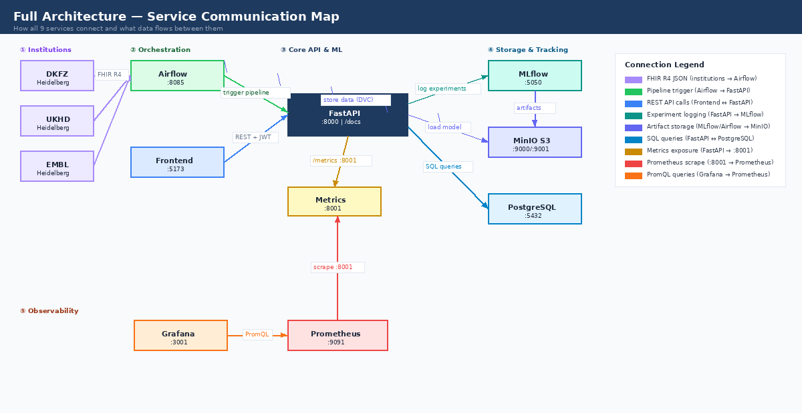
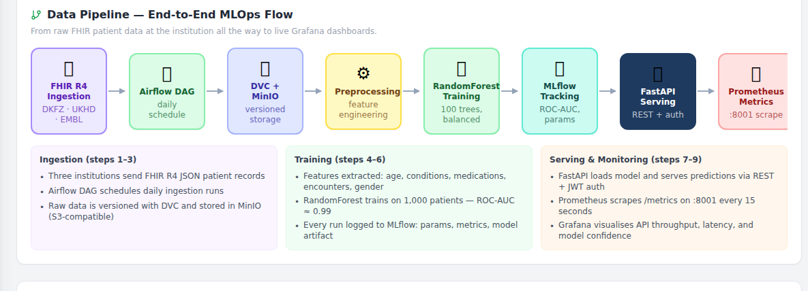
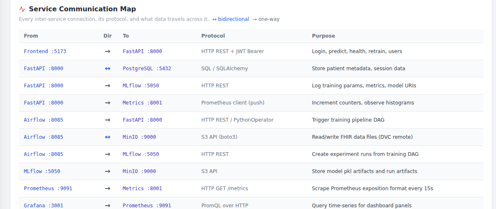

# HealthAlliance DataSpace — MLOps Platform

> Federated ML platform for privacy-preserving patient readmission prediction across three German research institutions (DKFZ · UKHD · EMBL), built with FastAPI, scikit-learn, Docker, and Kubernetes.

[](https://www.python.org/)
[](https://fastapi.tiangolo.com/)
[](https://react.dev/)
[](https://www.typescriptlang.org/)
[](https://www.docker.com/)
[](https://kubernetes.io/)
[](https://www.terraform.io/)
[](https://mlflow.org/)
[](tests/)
[](LICENSE)
[](https://hl7.org/fhir/R4/)
[](docs/gdpr_compliance.md)

---

## What This Project Solves

Healthcare data is siloed across institutions and too sensitive to centralise. This platform lets three German research centres collaborate on a shared ML model for patient readmission risk — without raw patient data ever leaving each institution's environment.

- FHIR R4 ingestion pipeline validated against the HL7 standard
- Hybrid cloud: MinIO on-premise S3 + AWS cloud connected by IPSec VPN (Terraform)
- Full MLOps loop: Airflow scheduling → DVC versioning → MLflow tracking → Kubernetes serving
- Production-grade Kubernetes manifests with HPA (3–10 replicas) and ServiceMonitor
- GDPR / HIPAA compliance documentation

---

## Quick Start

```bash
cp .env.example .env
docker compose up -d --build
open http://localhost:5173
```

Login: `admin / admin123` or `analyst / analyst123` — no AWS account needed to run locally.

---

## Dashboard Screenshots

### Login


Secure JWT authentication. Two roles: **admin** (full access including user management and model retraining) and **analyst** (read and predict only). Demo credentials are shown on the page for quick access.

---

### Dashboard — Service Health + Diagrams


The main view contains four sections:
- **Stat cards** — live counts for services online, model ROC-AUC, training samples, and institutions
- **Service health grid** — real-time status for all 9 services; each card shows port and a direct link
- **Architecture diagram** — interactive SVG showing every service as a node with labeled arrows for each connection
- **Data pipeline flow** — 9-step horizontal flow from FHIR ingestion to Grafana, with protocol descriptions
- **Service communication table** — all 11 inter-service connections with direction, protocol, and purpose

---

### Risk Prediction


Submit a patient record and receive a readmission risk score from the trained RandomForest model. Three demo presets fill the form instantly:

| Preset | Score | Level | Key factors |
|---|---|---|---|
| Low-risk young | 0% | LOW | Age 28, no conditions, no prior visits |
| Medium risk | 40% | MEDIUM | Age 70, 8 conditions — no recent inpatient visits |
| High-risk elderly | 100% | HIGH | Age 75, 8+ conditions, 16+ medications, 3 prior visits |

Results include risk score, confidence, and clinical recommendations. A session history table tracks all predictions.

---

### Monitoring & Observability


Direct links to every monitoring tool running in Docker with port numbers and Open buttons. Clickable Prometheus query shortcuts let you explore raw metrics immediately. The reference table lists all 6 custom metrics exported by the API.

---

### Admin Panel


Admin-only panel with two sections: user management (create/delete users without touching the database) and model retraining (trigger a background training job, watch status, see final ROC-AUC once done).

---

### Partner Institutions


Shows all three federated partner institutions with their patient counts: DKFZ (500), UKHD (700), EMBL (300) — 1,500 total patients across the network.

---

## Architecture Diagrams

### 1. Full Architecture — Service Communication



This diagram shows all 9 services as colored nodes organised in 5 layers:

| Layer | Services | Role |
|---|---|---|
| ① Institutions | DKFZ, UKHD, EMBL | Source of FHIR R4 patient records |
| ② Orchestration | Airflow, Frontend | Pipeline scheduling and user interface |
| ③ Core API & ML | FastAPI, Metrics sidecar | Prediction serving and metrics exposure |
| ④ Storage & Tracking | MLflow, MinIO S3, PostgreSQL | Model artifacts, experiment history, relational data |
| ⑤ Observability | Prometheus, Grafana | Metrics collection and visualisation |

**How services connect:**

| Connection | Protocol | What travels |
|---|---|---|
| Institutions → Airflow | FHIR R4 JSON / HTTPS | Raw patient records from each institution |
| Airflow → FastAPI | HTTP REST | Trigger model retraining pipeline |
| Airflow ↔ MinIO | S3 API (boto3) | Store and retrieve DVC-versioned data files |
| Frontend → FastAPI | HTTP REST + JWT Bearer | Login, predict, health checks, admin actions |
| FastAPI → MLflow | HTTP REST | Log training params, metrics, and model URIs |
| FastAPI → MinIO | S3 API | Load trained model `.pkl` artifact at startup |
| FastAPI ↔ PostgreSQL | SQL / SQLAlchemy | Patient metadata, session data |
| FastAPI → Metrics :8001 | Prometheus client (in-process) | Increment counters and histograms per request |
| Prometheus → Metrics :8001 | HTTP GET /metrics | Scrape Prometheus exposition format every 15 s |
| Grafana → Prometheus | PromQL over HTTP | Query time-series for dashboard panels |
| MLflow → MinIO | S3 API | Store model `.pkl` artifacts and run metadata |

---

### 2. Data Pipeline — End-to-End MLOps Flow



The full lifecycle from raw data to live monitoring, in 9 steps:

**Steps 1–3 · Data Ingestion**

1. **FHIR R4 Ingestion** — DKFZ, UKHD, and EMBL push patient records in HL7 FHIR R4 JSON format. Each record contains `resourceType`, `id`, `gender`, and `birthDate`. Records that fail validation are rejected at the boundary.
2. **Airflow DAG** — Apache Airflow runs a daily scheduled DAG (`data_ingestion_dag.py`) that picks up new records from each institution and writes them to the DVC remote.
3. **DVC + MinIO S3** — Raw and processed data files are version-controlled with DVC. MinIO acts as the S3-compatible remote, simulating an on-premise institution data store. Every dataset version is reproducible.

**Steps 4–6 · Model Training**

4. **Feature Engineering** — Five features are extracted per patient: `age`, `num_conditions`, `num_medications`, `recent_encounters`, `gender_encoded`. Missing values are filled with zero.
5. **RandomForest Training** — A `RandomForestClassifier` (100 trees, `class_weight="balanced"`, `max_depth=10`) is trained on **101,763 real diabetic patients** from the [UCI Diabetes 130-US Hospitals dataset](https://archive.ics.uci.edu/dataset/296/diabetes+130-us+hospitals+for+years+1999-2008). An 80/20 stratified split is used for evaluation. ROC-AUC = 0.63 — a realistic score for 30-day readmission prediction on real clinical data.
6. **MLflow Tracking** — Every training run logs hyperparameters, ROC-AUC, classification report, feature importances, and the serialized model file. The MLflow UI at `:5050` shows the full run history.

**Steps 7–9 · Serving & Monitoring**

7. **FastAPI Serving** — The API loads the trained model at startup. Each `POST /api/v1/predict` call runs inference and returns risk score, level, confidence, and clinical recommendations. Dual auth: `X-API-Key` (legacy) and `Bearer JWT` (frontend).
8. **Prometheus Metrics** — A Prometheus sidecar runs on `:8001`. Every API request increments `http_requests_total`, observes `http_request_duration_seconds`, and the predict endpoint records `predictions_total`, `prediction_duration_seconds`, and `model_confidence_score`. Prometheus scrapes this endpoint every 15 seconds.
9. **Grafana Dashboards** — Grafana connects to Prometheus via PromQL and visualises API throughput, latency distribution, prediction volume by risk level, and model confidence over time. Import the dashboard from `monitoring/grafana-dashboard.json`.

---

### 3. Service Communication Map



All 11 inter-service connections in one table. Each row shows:
- **From / To** — which service initiates and which receives
- **Direction** — `→` one-way or `↔` bidirectional
- **Protocol** — the exact technology used (REST, SQL, S3 API, PromQL, FHIR R4)
- **Purpose** — what data or command travels across that link

This map is also embedded as a live interactive table inside the Dashboard page of the React UI.

---

## Tech Stack

| Layer | Technology |
|---|---|
| **API** | FastAPI (Python 3.10), Pydantic v2, Uvicorn |
| **Frontend** | React 18, TypeScript, Vite, Tailwind CSS |
| **ML** | scikit-learn RandomForest (100 trees, balanced class weights) |
| **Experiment Tracking** | MLflow |
| **Orchestration** | Apache Airflow (data ingestion + training DAGs) |
| **Data Versioning** | DVC + S3 remote |
| **Infrastructure** | Terraform 13-module AWS stack: VPC, EKS, RDS, Lambda, ECR, S3, IAM, ALB |
| **Containers** | Docker Compose (local) · Kubernetes EKS (production) |
| **On-Premise Storage** | MinIO (S3-compatible) |
| **Monitoring** | Prometheus + Grafana, K8s ServiceMonitor |
| **CI/CD** | GitHub Actions |

---

## Local Services

| Service | URL | Notes |
|---|---|---|
| **Frontend** | http://localhost:5173 | React dashboard |
| **FastAPI** | http://localhost:8000 | REST API + `/docs` |
| **Metrics** | http://localhost:8001/metrics | Prometheus scrape endpoint |
| **MLflow** | http://localhost:5050 | Experiment tracking |
| **Prometheus** | http://localhost:9091 | Metrics storage |
| **Grafana** | http://localhost:3001 | Dashboards — `admin / admin_change_in_production` |
| **MinIO Console** | http://localhost:9001 | Object storage |
| **Airflow** | http://localhost:8085 | Pipeline scheduler — `admin / admin123` |
| **PostgreSQL** | localhost:5432 | Relational database |

---

## API Usage

```bash
# Health check
curl http://localhost:8000/health

# Predict patient readmission risk
curl -X POST http://localhost:8000/api/v1/predict \
  -H "X-API-Key: dev-key-dkfz" \
  -H "Content-Type: application/json" \
  -d '{
    "patient_id": "P001",
    "age": 72,
    "gender": "male",
    "conditions": ["diabetes", "hypertension", "CHF"],
    "medications": ["metformin", "lisinopril", "furosemide", "warfarin", "digoxin", "aspirin"],
    "recent_encounters": 5
  }'
```

**Response:**
```json
{
  "patient_id": "P001",
  "readmission_risk": 1.0,
  "risk_level": "HIGH",
  "confidence": 0.99,
  "recommendations": [
    "Immediate follow-up within 48 hours",
    "Consider home health services",
    "Review medication plan"
  ]
}
```

Swagger UI at `http://localhost:8000/docs`.

---

## Tests

```bash
pip install -r requirements.txt
pytest tests/ -v --cov=src --cov-report=term-missing
```

37 tests across three suites:

| Suite | What it covers |
|---|---|
| `test_api.py` | Auth, all endpoints, FHIR ingestion, edge cases |
| `test_data.py` | FHIR R4 validation, feature preprocessing, institution parsing |
| `test_models.py` | Training, prediction, serialization |

---

## Project Structure

```
HealthAlliance-DataSpace-MLOps/
├── src/
│   ├── api/          # FastAPI app — endpoints, auth, CORS
│   ├── models/       # RandomForest training, prediction, serialization
│   ├── data/         # FHIR R4 validation, preprocessing, feature engineering
│   ├── pipelines/    # End-to-end training pipeline with MLflow logging
│   └── monitoring/   # Prometheus metrics and sidecar server
├── frontend/         # React 18 + TypeScript + Tailwind dashboard
├── tests/            # 37 pytest tests
├── infra/terraform/  # 13-module AWS infrastructure
├── k8s/              # 13 Kubernetes manifests
├── airflow/dags/     # Data ingestion and training DAGs
├── monitoring/       # Prometheus alert rules + Grafana dashboard JSON
├── docs/             # Architecture, API, deployment, compliance docs
└── scripts/          # Training script
```

---

## AWS Deployment

See [docs/deployment_guide.md](docs/deployment_guide.md) for the step-by-step guide.

```bash
cd infra/terraform
terraform init
terraform apply
```

---

## Documentation

| Document | Description |
|---|---|
| [docs/architecture.md](docs/architecture.md) | System architecture with ASCII diagrams |
| [docs/api_documentation.md](docs/api_documentation.md) | All endpoints with request/response schemas |
| [docs/deployment_guide.md](docs/deployment_guide.md) | Local → AWS step-by-step deployment |
| [docs/fhir_integration.md](docs/fhir_integration.md) | FHIR R4 validation and ingestion flow |
| [docs/gdpr_compliance.md](docs/gdpr_compliance.md) | GDPR data minimization and retention policy |
| [docs/hipaa_compliance.md](docs/hipaa_compliance.md) | PHI handling, audit trails, access controls |
| [docs/hybrid_cloud.md](docs/hybrid_cloud.md) | On-premise MinIO + IPSec VPN integration |
| [docs/troubleshooting.md](docs/troubleshooting.md) | Common issues and fixes |

---

## License

[MIT](LICENSE)
